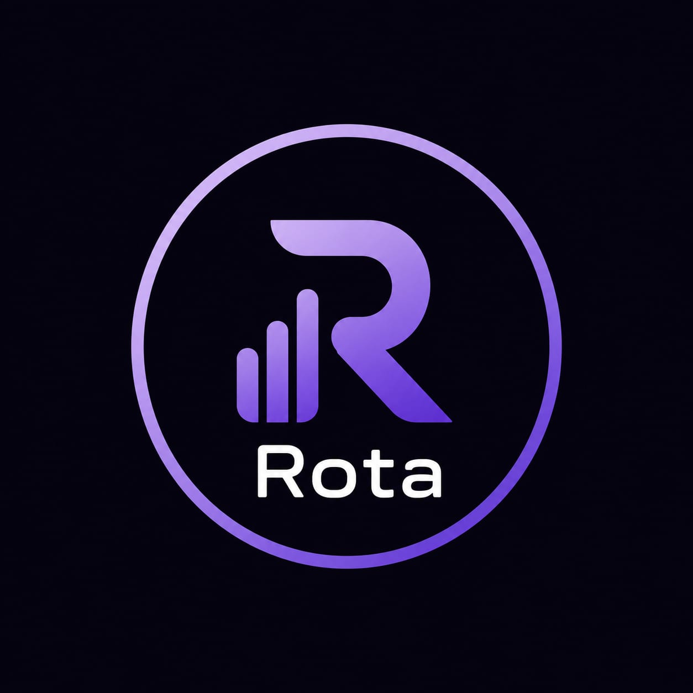
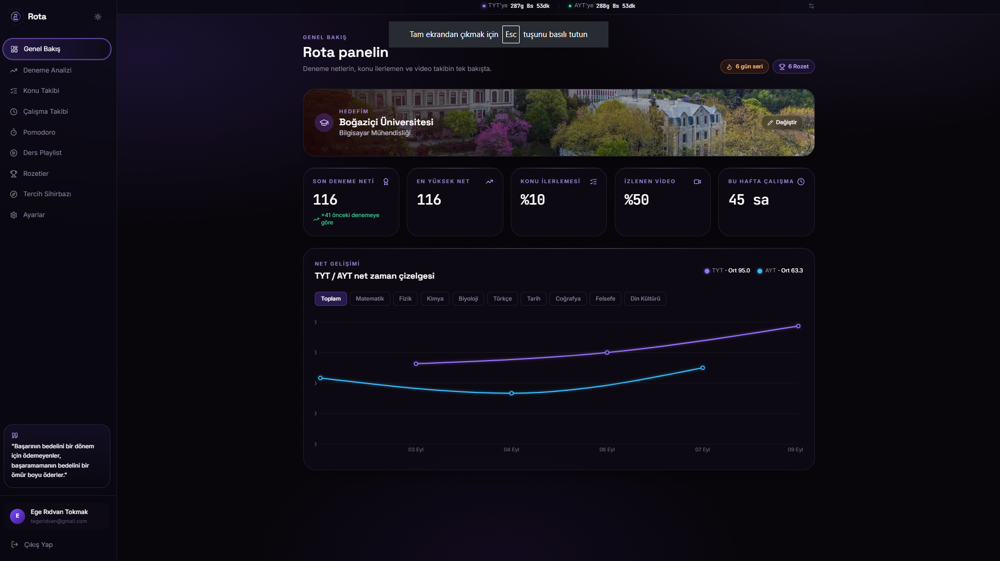
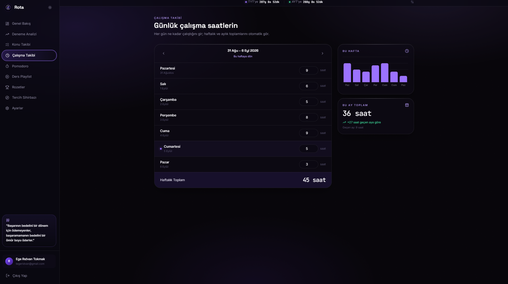
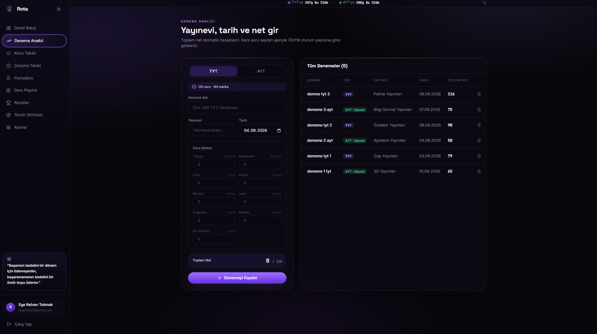
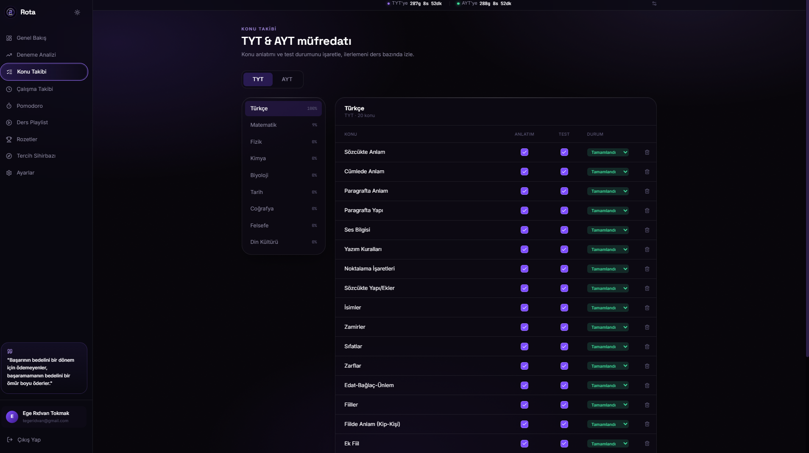
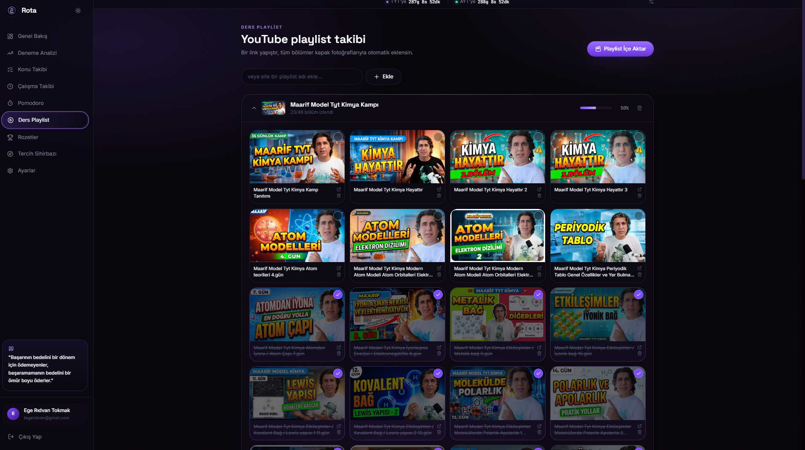
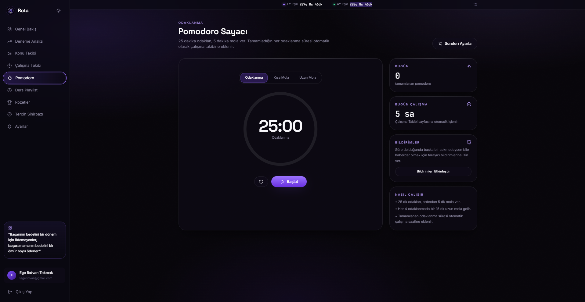
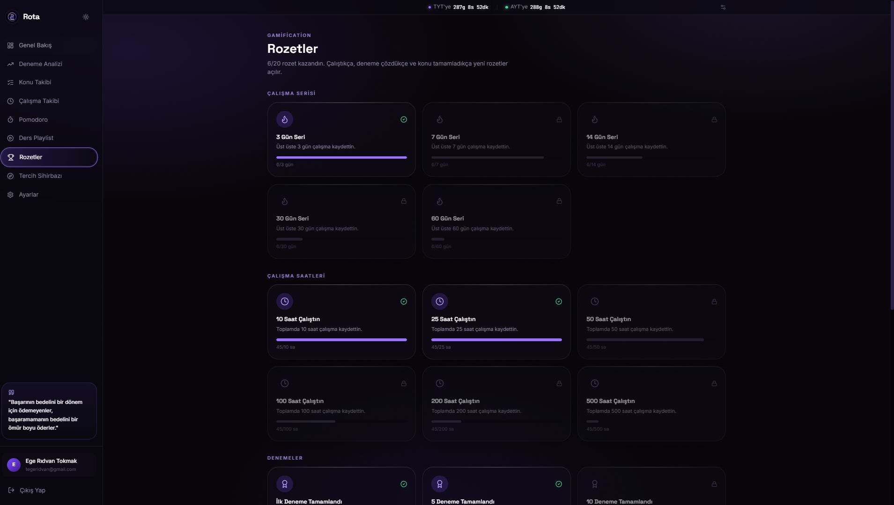
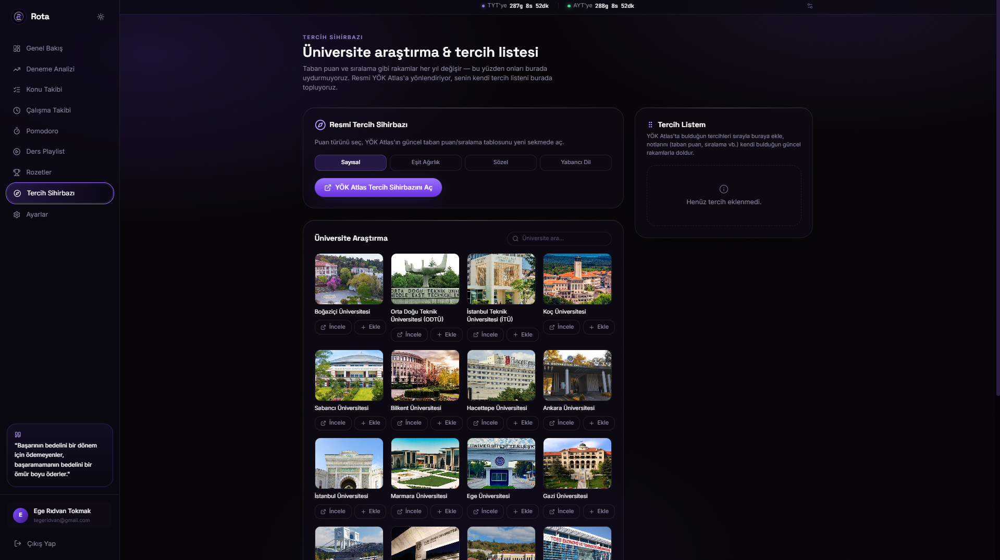
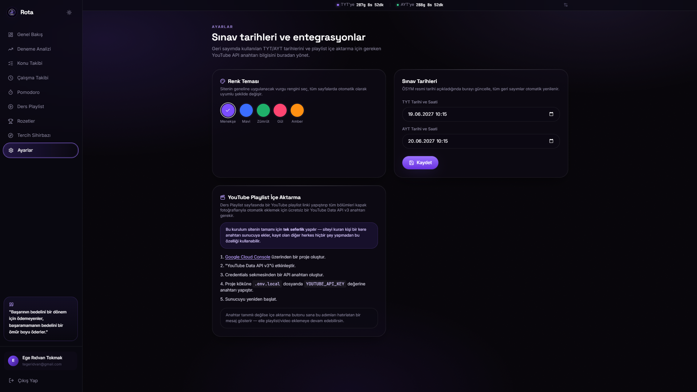

<div align="center">



# ROTA

🎯 YKS hazırlığını tek bir yerde planla, takip et ve analiz et.

<p>
  <strong>Next.js • TypeScript • PWA • Giriş Sistemli • Kişisel</strong>
</p>

<br>


<br><br>

<!-- Ekran görüntüsü eklemek için docs/screenshots/ klasörü oluştur ve
     dashboard.png, study.png, exams.png, topics.png, videos.png, pomodoro.png,
     achievements.png, tercih.png, settings.png dosyalarını içine koy -->



<br><br>

<a href="#-ekran-görüntüleri">Ekran Görüntüleri</a>
 • 
<a href="#-özellikler">Özellikler</a>
 • 
<a href="#️-kurulum">Kurulum</a>
 • 
<a href="#-canlıya-alma">Canlıya Alma</a>
 • 
<a href="#️-roadmap">Roadmap</a>

</div>

---

## 🚀 Proje Hakkında

**Rota**, YKS sürecini dağınık not defterlerinden ve onlarca farklı uygulamadan kurtarıp
tek bir panelde toplamak için geliştirilmiş, giriş sistemi olan kişisel bir takip platformudur.

TYT/AYT konu ilerlemesinden deneme net analizine, YouTube ders playlist takibinden
Pomodoro'ya, hedef üniversiteden başarımlara kadar YKS'ye hazırlanan bir öğrencinin
ihtiyaç duyabileceği her şey burada.

> Amaç: Sadece *ne kadar* çalıştığını değil, *nasıl* ilerlediğini görebilmek.

Her kullanıcı kendi hesabıyla giriş yapar (e-posta + şifre, bcrypt ile şifrelenir),
veriler dosya tabanlı bir veritabanında (`data/db.json`) saklanır — harici bir
veritabanı sunucusu kurmana gerek kalmaz.

## ✨ Özellikler

<table>
<tr>
<td width="50%">

### 🔐 Giriş Sistemi
E-posta/şifre ile kayıt-giriş, JWT oturum yönetimi. Tüm uygulama sayfaları
girişsiz açılamaz.

### ⏳ Sınav Geri Sayımı
TYT ve AYT için her sayfanın üstünde canlı gün/saat/dakika/saniye sayacı.
Tarihler Ayarlar'dan düzenlenebilir.

### 📝 Deneme Analizi
Yayınevi otomatik tamamlama, TYT/AYT ders netleri, AYT alan seçimi
(Sayısal/EA/Sözel/Dil), gerçek ÖSYM soru dağılımı referansı, otomatik net
hesaplama ve gelişim grafiği.

### 📖 Konu Takibi
Gerçek müfredata uygun hazır TYT/AYT ders-konu listesi. Her konu için
"Konu Anlatımı" ve "Test" ayrı ayrı işaretlenir.

### 🎬 Ders Playlist Takibi
YouTube playlist linkini yapıştır, tüm bölümler başlık ve kapak fotoğrafıyla
otomatik eklensin. İzlenen videolar işaretlenir, sitenin içinde oynatılır.

</td>
<td width="50%">

### ⏱️ Pomodoro
25 dk odaklan / 5 dk kısa mola / 15 dk uzun mola. Tamamlanan süreler otomatik
olarak Çalışma Takibi'ne eklenir.

### 🎯 Hedef Üniversite
İlk girişte hedef üniversite/bölüm seç, panelin üstünde motive edici bir
banner olarak görünsün.

### 🔥 Streak Sistemi
Düzenli çalışma alışkanlığını takip eden günlük seri (streak) göstergesi.

### 🏆 Başarımlar
Çalışma saati, deneme sayısı, tamamlanan konu ve streak bazlı kilometre
taşları — otomatik açılır, ilerleme çubuğuyla gösterilir.

### 🎓 Tercih Sihirbazı
20 bilinen üniversite için görsel kartlarla arama, resmi YÖK Atlas Tercih
Sihirbazı'na yönlendirme, kendi sıralı "Tercih Listem" alanına not düşme.

### 🌗 Karanlık/Aydınlık Tema
Gerçek bir tema değiştirici, seçim tarayıcıda hatırlanır.

</td>
</tr>
</table>

## 🖼️ Ekran Görüntüleri

<div align="center">

**📊 Dashboard**


<br><br>

<table>
<tr>
<td align="center">

<br><strong>📚 Çalışma</strong>
</td>
<td align="center">

<br><strong>📝 Denemeler</strong>
</td>
</tr>
<tr>
<td align="center">

<br><strong>📖 Konular</strong>
</td>
<td align="center">

<br><strong>🎬 Videolar</strong>
</td>
</tr>
<tr>
<td align="center">

<br><strong>⏱️ Pomodoro</strong>
</td>
<td align="center">

<br><strong>🏆 Başarımlar</strong>
</td>
</tr>
<tr>
<td align="center">

<br><strong>🎓 Tercih</strong>
</td>
<td align="center">

<br><strong>⚙️ Ayarlar</strong>
</td>
</tr>
</table>

</div>

> Ekran görüntülerini eklemek için proje köküne `docs/screenshots/` klasörü oluştur
> ve yukarıdaki dosya adlarıyla PNG'leri içine koy.

## 🧠 Mimari

```
Rota
│
├── Authentication
│   ├── Login / Register
│   ├── bcrypt şifreleme
│   └── JWT oturum (NextAuth)
│
├── Application  (src/app/(app)/)
│   ├── Dashboard        → özet + net grafiği
│   ├── Study            → çalışma oturumları
│   ├── Topics           → TYT/AYT konu takibi
│   ├── Videos           → YouTube playlist takibi
│   ├── Exams            → deneme kayıt ve analiz
│   ├── Pomodoro         → odak sayacı
│   ├── Achievements     → başarımlar
│   ├── Tercih           → üniversite/tercih listesi
│   └── Settings         → sınav tarihleri, API anahtarı
│
├── API  (src/app/api/)
│   ├── auth, register
│   ├── courses (playlist), videos
│   ├── topics, exams, study
│   ├── goal, preferences
│   └── settings
│
└── PWA
    ├── Service Worker (public/sw.js)
    ├── Offline sayfa (public/offline.html)
    └── Ana ekrana kurulabilir manifest
```

## 🛠️ Teknoloji Yığını

<div align="center">


</div>

<br>

| Teknoloji | Kullanım |
|---|---|
| **Next.js 14** (App Router) | Full-stack React framework |
| **TypeScript** | Type-safe geliştirme |
| **Tailwind CSS** | Modern, responsive stil |
| **NextAuth.js** (Credentials) | Giriş sistemi, JWT oturum |
| **bcryptjs** | Şifre hashleme |
| **lowdb** | Dosya tabanlı JSON veritabanı (`data/db.json`) |
| **Recharts** | Net gelişim grafikleri |
| **lucide-react** | İkonlar |
| **YouTube Data API v3** | Playlist içe aktarma (opsiyonel) |

## 📱 PWA

Rota klasik bir web sitesi olarak değil, kurulabilir bir uygulama gibi tasarlandı:

- 📲 Ana ekrana kurulabilir (`manifest.webmanifest`)
- ⚡ Service worker ile daha uygulama benzeri deneyim
- 🌐 Offline sayfa desteği
- 🖥️ Telefon, tablet ve masaüstü ekranlarına uyumlu

## 🎨 Tasarım

Mor–siyah–beyaz renk paleti, koyu tema, geniş yuvarlatılmış köşeler, cam efektli
(glassmorphism) kartlar ve ince geçiş animasyonlarıyla sade, Apple tarzı bir arayüz.

- Minimal ve modern UI
- Responsive layout (mobil öncelikli navigasyon)
- Karanlık / aydınlık tema desteği
- Tutarlı component sistemi
- Görsel olarak anlaşılır ilerleme göstergeleri (progress bar, grafik, rozet)

## ⚙️ Kurulum

Bilgisayarında **Node.js 18.18 veya üzeri** kurulu olmalı:

```bash
node -v
```

Kurulum adımları:

```bash
# 1) Repoyu klonla
git clone https://github.com/USERNAME/rota.git
cd rota

# 2) Bağımlılıkları yükle
npm install

# 3) Ortam değişkenlerini oluştur
cp .env.example .env.local
```

`.env.local` içindeki `NEXTAUTH_SECRET` alanına rastgele, uzun bir metin yaz
(`openssl rand -hex 32` ile üretebilirsin). `YOUTUBE_API_KEY` boş bırakılabilir —
playlist içe aktarma özelliğini kullanmak istersen aşağıdaki nota bak.

```bash
# 4) Development server'ı başlat
npm run dev
```

Uygulama varsayılan olarak **http://localhost:3000** adresinde çalışır. Hesap
oluşturduğunda TYT/AYT konu listeleri otomatik yüklenir, örnek bir playlist eklenir.

> ⚠️ `.env.local` dosyasını GitHub'a göndermeyin.

### 🎬 YouTube Playlist İçe Aktarma (opsiyonel)

1. [Google Cloud Console](https://console.cloud.google.com/apis/library/youtube.googleapis.com)'da bir proje oluştur.
2. **YouTube Data API v3**'ü etkinleştir.
3. Credentials sekmesinden bir API anahtarı oluştur.
4. `.env.local` → `YOUTUBE_API_KEY` alanına yapıştır.
5. Sunucuyu yeniden başlat.

Anahtar tanımlı değilse "Playlist İçe Aktar" butonu bu adımları hatırlatan bir
hata mesajı gösterir; bölümleri elle eklemeye devam edebilirsin.

### 🖼️ Hedef Üniversite Fotoğrafları

Banner'da üniversite fotoğrafı göstermek için `public/universities/` klasörüne
kendi fotoğraflarını ekle (detaylı liste o klasördeki `README.md` içinde).
Fotoğraf eklemezsen sistem otomatik olarak üniversite adının baş harfleriyle
şık bir kart gösterir.

## 💾 Veri Nerede Saklanıyor?

Tüm kullanıcılar, denemeler, konular ve playlist verileri `data/db.json`
dosyasında tutulur; ilk kayıtla otomatik oluşur. Yedeklemek için dosyayı
kopyalaman, sıfırlamak için silip sunucuyu yeniden başlatman yeterli.

> Bu, tek sunucuda çalışan kişisel kullanım için uygundur. İleride gerçek bir
> veritabanına (ör. PostgreSQL + Prisma) geçmek istersen sadece
> `src/lib/db.ts` içindeki fonksiyonları değiştirmen yeterli olur.

## 🚀 Canlıya Alma

`data/db.json` dosya tabanlı olduğu için **kalıcı disk** olan bir hosting gerekir.

> ⚠️ **Vercel kullanma** — dosya sistemi her istekte sıfırlanır, kayıtlı
> kullanıcılar ve denemeler kaybolur.

### Önerilen: Render.com (ücretsiz, kalıcı disk destekli)

1. Projeyi bir GitHub deposuna yükle.
2. [render.com](https://render.com)'da **New → Blueprint** seç, GitHub deponu
   bağla. Kökteki `render.yaml` build/disk/env ayarlarını otomatik kurar.
3. Render senden `NEXTAUTH_URL` ve `YOUTUBE_API_KEY` isteyecek; `NEXTAUTH_SECRET`
   otomatik ve güvenli şekilde üretilir.
4. Deploy tamamlanınca linki paylaş — veriler `yks-data` kalıcı diskinde durur.

### Alternatif: Railway.app

GitHub deponu bağla, "Add Volume" ile `/app/data` klasörünü kalıcı diske bağla,
aynı üç ortam değişkenini gir, deploy et.

### Kendi Sunucun / VPS

```bash
npm install
npm run build
npm run start
```

Nginx/Caddy ile ters proxy kurup alan adı bağlayabilirsin.

## 📂 Proje Yapısı

```
src/
├── app/
│   ├── (app)/
│   │   ├── achievements/
│   │   ├── dashboard/
│   │   ├── exams/
│   │   ├── pomodoro/
│   │   ├── settings/
│   │   ├── study/
│   │   ├── tercih/
│   │   ├── topics/
│   │   └── videos/
│   ├── login/, register/
│   └── api/
│       ├── auth/, register/
│       ├── courses/, videos/
│       ├── exams/, topics/, study/
│       ├── goal/, preferences/
│       └── settings/
│
├── components/
│   ├── sidebar.tsx
│   ├── mobile-nav.tsx
│   ├── page-header.tsx
│   ├── goal-banner.tsx
│   ├── goal-picker-modal.tsx
│   ├── streak-badge.tsx
│   ├── theme-toggle.tsx
│   ├── countdown-bar.tsx
│   ├── university-thumb.tsx
│   ├── video-player-modal.tsx
│   └── ...
│
└── lib/
    ├── auth.ts            → NextAuth yapılandırması
    ├── db.ts              → lowdb veritabanı katmanı
    ├── achievements.ts    → başarım hesaplama
    ├── streak.ts          → streak hesaplama
    ├── exam-rules.ts      → ÖSYM soru dağılımı
    ├── topics-seed.ts     → varsayılan konu listeleri
    ├── universities.ts / departments.ts / yokatlas.ts
    ├── publishers.ts
    └── youtube.ts         → playlist içe aktarma

data/db.json               → uygulama verisi (otomatik oluşur)
```

## 🗺️ Roadmap

- [x] Giriş sistemi (NextAuth + bcrypt)
- [x] Dashboard + net gelişim grafiği
- [x] Deneme sistemi (TYT/AYT, alan bazlı)
- [x] Konu takibi
- [x] YouTube playlist takibi
- [x] Pomodoro
- [x] Streak sistemi
- [x] Başarımlar
- [x] Hedef üniversite / tercih listesi
- [x] Karanlık/aydınlık tema
- [x] PWA (offline + kurulabilir)
- [ ] Gerçek veritabanına geçiş (PostgreSQL + Prisma)
- [ ] Çoklu cihaz senkronizasyonu
- [ ] Daha gelişmiş istatistik ve analiz ekranları
- [ ] Akıllı çalışma önerileri
- [ ] Mobil uygulama deneyiminin geliştirilmesi

## 🩹 Sorun mu Yaşadın?

- **"Cannot find module" hatası** → `npm install` komutunu tekrar çalıştır.
- **Giriş yapamıyorum** → `.env.local` içinde `NEXTAUTH_SECRET` dolu mu kontrol et.
- **Port 3000 kullanımda** → `npm run dev -- -p 3001` ile farklı port kullan.
- **Playlist içe aktarma çalışmıyor** → `YOUTUBE_API_KEY` tanımlı mı ve
  YouTube Data API v3 etkin mi kontrol et.

## 🤝 Katkıda Bulunma

1. Fork'la
2. Yeni bir branch oluştur
3. Değişikliklerini yap
4. Commit'le
5. Pull Request aç

Katkılar, fikirler ve geri bildirimler değerlidir. 🚀

## ⭐ Destek

Projeyi faydalı bulduysan GitHub'da ⭐ bırakman ve çevrende paylaşman yeterli.

<div align="center">

<br>

**🎯 Planla. Çalış. Takip Et. Geliş.**

**Rota**

<br>


<br><br>

<sub>Built with ❤️ for students preparing for YKS.</sub>

</div>
